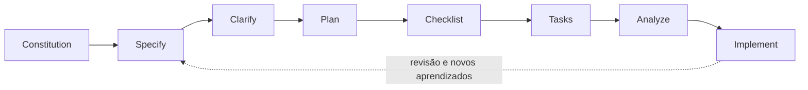

# Calculadora Interativa — um projeto didático de SDD

Uma calculadora pequena de console em C# e .NET 10, construída para demonstrar o fluxo completo de **Spec-Driven Development (SDD)** com Spec Kit.

O objetivo deste repositório vai além de fazer contas: cada decisão começa como um requisito documentado, passa por revisão e análise, e só então orienta a implementação. Assim, dá para acompanhar como a intenção registrada nos documentos chega ao código e aos testes.

## O percurso de SDD



| Etapa | Pergunta respondida | Artefato neste projeto |
|---|---|---|
| **Constitution** | Quais princípios governam todas as decisões? | [Constituição](.specify/memory/constitution.md) |
| **Specify** | O que a calculadora deve fazer e como saberemos que funciona? | [Especificação](specs/001-interactive-calculator/spec.md) |
| **Clarify** | Quais ambiguidades precisam de uma decisão explícita? | Decisões aprovadas registradas na seção *Clarifications* da especificação |
| **Plan** | Qual é a solução técnica mínima para cumprir os requisitos? | [Plano](specs/001-interactive-calculator/plan.md), [modelo de dados](specs/001-interactive-calculator/data-model.md), [contrato de console](specs/001-interactive-calculator/contracts/console.md) e [pesquisa](specs/001-interactive-calculator/research.md) |
| **Checklist** | Os requisitos estão claros, completos e consistentes? | [Checklist de qualidade](specs/001-interactive-calculator/checklists/calculator.md) e [checklist de requisitos](specs/001-interactive-calculator/checklists/requirements.md) |
| **Tasks** | Como dividir o trabalho em incrementos pequenos e verificáveis? | [Tarefas](specs/001-interactive-calculator/tasks.md) |
| **Analyze** | Especificação, plano, contratos e tarefas concordam entre si? | Achados foram corrigidos nos documentos antes da implementação |
| **Implement** | O código e os testes atendem ao comportamento especificado? | Projetos em [`src/`](src/Calculator/) e [`tests/`](tests/Calculator.Tests/) |

As histórias foram implementadas em incrementos revisáveis: primeiro os cálculos válidos, depois a recuperação de erros e, por fim, a repetição e o encerramento da sessão. Cada incremento foi compilado e testado antes de seu commit.

## O que a calculadora faz

- Soma, subtrai, multiplica e divide dois números.
- Aceita inteiros, negativos e decimais com vírgula, como `-2,25`.
- Permite corrigir entradas inválidas sem perder os operandos que já eram válidos.
- Trata divisão por zero e resultados fora do intervalo com mensagens específicas.
- Permanece aberta para novos cálculos e encerra quando o usuário escolhe sair.
- Termina defensivamente se a entrada acabar, sem repetir a leitura indefinidamente nem exibir um resultado parcial.

As entradas e os resultados ficam no intervalo inclusivo de `-1000000000` a `1000000000`. A entrada pode ter até seis casas decimais efetivas. Os resultados são arredondados somente para apresentação, com até seis casas, desempate para longe de zero e remoção de zeros finais. A especificação define os formatos aceitos e os demais casos de fronteira em detalhe.

## Como a solução está organizada

A aplicação mantém a separação necessária para aprender e testar cada responsabilidade sem criar camadas artificiais:

- **Apresentação** (`src/Calculator/Presentation/`) lê as escolhas e os números, valida o formato textual, coordena a sessão, apresenta mensagens e formata resultados para `pt-BR`.
- **Domínio** (`src/Calculator/Domain/`) representa as operações e resultados, valida a política numérica e calcula sem ler ou escrever no console.
- **Ponto de entrada** (`src/Calculator/Program.cs`) conecta a sessão à entrada e à saída padrão.
- **Testes** (`tests/Calculator.Tests/`) verificam regras de cálculo, parsing, formatação, recuperação de erros, repetição e EOF sem depender de interação manual.

Código, tipos e identificadores estão em inglês; documentos e mensagens para o usuário estão em português do Brasil, conforme a constituição do projeto.

## Estrutura

```text
.
├── .specify/
│   └── memory/constitution.md
├── specs/
│   └── 001-interactive-calculator/
│       ├── checklists/
│       ├── contracts/
│       ├── data-model.md
│       ├── plan.md
│       ├── quickstart.md
│       ├── research.md
│       ├── spec.md
│       └── tasks.md
├── src/
│   └── Calculator/
└── tests/
    └── Calculator.Tests/
```

## Requisitos

- SDK do .NET 10.
- Acesso ao NuGet para restaurar os pacotes de teste na primeira execução.

Confira o SDK instalado:

```sh
dotnet --info
```

## Restaurar, compilar e testar

Na raiz do repositório:

```sh
dotnet restore tests/Calculator.Tests/Calculator.Tests.csproj
dotnet build tests/Calculator.Tests/Calculator.Tests.csproj --no-restore
dotnet test tests/Calculator.Tests/Calculator.Tests.csproj --no-build --no-restore
```

Para executar a calculadora:

```sh
dotnet run --project src/Calculator/Calculator.csproj
```

Os roteiros manuais de aceitação, incluindo limites numéricos, entradas inválidas e EOF, estão no [guia de validação](specs/001-interactive-calculator/quickstart.md).

## Estado da validação

Na validação da integração em `main`, a compilação terminou sem avisos ou erros e os **91 testes automatizados passaram**. Execute novamente os comandos acima após qualquer alteração.

## Licença

Este repositório não declara uma licença de uso. Consulte o responsável pelo projeto antes de reutilizar ou redistribuir o conteúdo.
